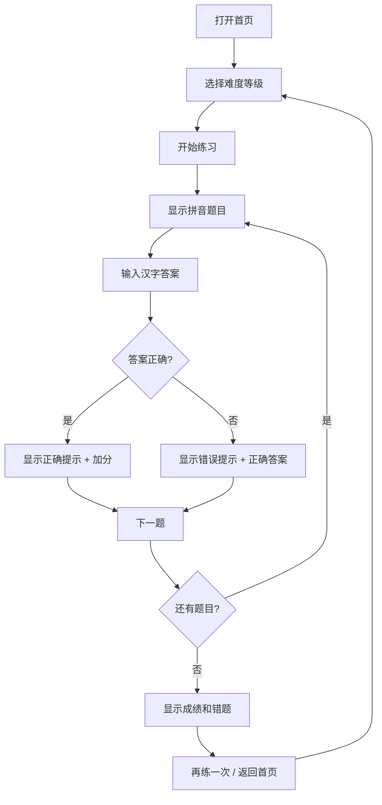

## 1. 产品概述
一款面向小学生的「看拼音写词语」在线练习工具，通过趣味化的界面设计帮助学生巩固汉语拼音和汉字书写能力。
- 主要用途：小学生课后语文练习、拼音汉字巩固学习
- 目标用户：小学1-6年级学生、家长、老师

## 2. 核心功能

### 2.1 用户角色
无需注册登录，所有用户直接使用。

### 2.2 功能模块
1. **首页**：选择难度等级、开始练习入口
2. **练习页**：拼音展示、答题输入、即时反馈、进度显示
3. **结果页**：成绩统计、错题回顾、重新开始

### 2.3 页面详情
| 页面名称 | 模块名称 | 功能描述 |
|-----------|-------------|---------------------|
| 首页 | 难度选择 | 提供「简单/中等/困难」三个难度等级选择 |
| 首页 | 题目预览 | 显示对应难度的题目数量和练习范围 |
| 首页 | 开始按钮 | 一键进入练习模式 |
| 练习页 | 拼音卡片 | 大字展示当前题目拼音（带声调） |
| 练习页 | 答题输入 | 汉字输入框，支持回车提交 |
| 练习页 | 即时反馈 | 答对显示绿色✓，答错显示红色✗和正确答案 |
| 练习页 | 进度条 | 显示当前题目数/总题数 |
| 练习页 | 分数显示 | 实时显示得分 |
| 练习页 | 跳过题目 | 可选跳过当前题目 |
| 结果页 | 成绩统计 | 显示正确率、得分、用时 |
| 结果页 | 错题列表 | 列出答错的题目（拼音+正确答案） |
| 结果页 | 操作按钮 | 再练一次、返回首页 |

## 3. 核心流程
用户打开应用 → 选择难度等级 → 开始练习 → 逐题看拼音写词语 → 系统即时判定对错 → 完成所有题目 → 查看成绩和错题 → 可选择重新练习或返回首页

## 4. 用户界面设计

### 4.1 设计风格
- **主色调**：天蓝色 (#4A90D9) 为主，搭配活泼的橙黄色 (#FFB347) 和草绿色 (#7ED321)
- **按钮风格**：圆润大按钮，带轻微阴影，hover时有上浮效果
- **字体**：使用圆润可爱的中文字体（如站酷快乐体、方正喵呜体替代方案），大号字体方便小学生阅读
- **布局风格**：卡片式布局，大量留白，元素居中对称
- **图标/emoji**：大量使用表情符号点缀，增加趣味性 🎯⭐📝✨

### 4.2 页面设计概述
| 页面名称 | 模块名称 | UI元素 |
|-----------|-------------|-------------|
| 首页 | 难度卡片 | 三个彩色卡片（蓝/橙/绿），点击选中，带hover缩放动画 |
| 首页 | 标题区域 | 大标题+拼音，可爱图标装饰 |
| 练习页 | 拼音展示区 | 大号拼音卡片，圆角渐变背景 |
| 练习页 | 答题区 | 大输入框，提交按钮，跳过按钮 |
| 练习页 | 状态栏 | 顶部进度条，分数，题目序号 |
| 结果页 | 成绩展示 | 大分数数字，星级评价，统计信息 |
| 结果页 | 错题列表 | 可滚动列表，每项显示拼音和正确答案 |

### 4.3 响应性
- 桌面端优先设计，自适应平板和手机屏幕
- 触摸友好：大按钮、大输入框，间距充足
- 竖屏和横屏都能良好显示
