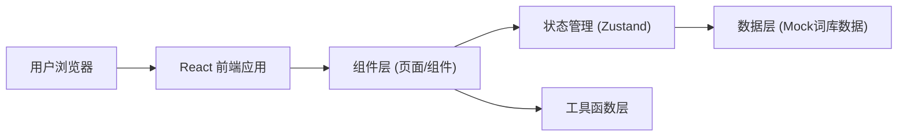

## 1. 架构设计



## 2. 技术描述
- **前端框架**：React@18 + TypeScript
- **构建工具**：Vite
- **样式方案**：Tailwind CSS@3
- **状态管理**：Zustand
- **路由管理**：React Router DOM
- **图标库**：Lucide React
- **后端**：无（纯前端应用，词库数据内置）
- **数据库**：无（使用本地词库JSON数据）

## 3. 路由定义
| 路由 | 页面组件 | 功能说明 |
|-------|---------|---------|
| `/` | HomePage | 首页 - 选择难度等级 |
| `/practice` | PracticePage | 练习页 - 看拼音写词语 |
| `/result` | ResultPage | 结果页 - 成绩统计和错题 |

## 4. 数据模型

### 4.1 词语数据结构
```typescript
interface WordItem {
  id: number;
  pinyin: string;      // 带声调拼音，如 "pīn yīn"
  word: string;        // 正确词语，如 "拼音"
  level: 1 | 2 | 3;    // 难度等级：1简单 2中等 3困难
}
```

### 4.2 练习状态
```typescript
interface PracticeState {
  level: 1 | 2 | 3;
  currentIndex: number;
  totalQuestions: number;
  score: number;
  correctCount: number;
  wrongAnswers: WrongAnswer[];
  answers: AnswerRecord[];
  startTime: number;
}

interface WrongAnswer {
  pinyin: string;
  correctWord: string;
  userAnswer: string;
}

interface AnswerRecord {
  wordId: number;
  userAnswer: string;
  isCorrect: boolean;
}
```

### 4.3 词库数据（Mock数据）
- **简单（Level 1）**：小学1-2年级常见两字词语，约50个
  例如：学校、同学、老师、语文、数学、读书、写字等
- **中等（Level 2）**：小学3-4年级词语，约50个
  例如：知识、学习、努力、成功、友谊、勇敢、勤劳等
- **困难（Level 3）**：小学5-6年级词语/成语，约50个
  例如：博览群书、孜孜不倦、聚精会神、脚踏实地等

## 5. 核心组件结构

```
src/
├── components/
│   ├── DifficultyCard.tsx    # 难度选择卡片
│   ├── PinyinCard.tsx        # 拼音展示卡片
│   ├── AnswerInput.tsx       # 答案输入组件
│   ├── ProgressBar.tsx       # 进度条组件
│   ├── FeedbackToast.tsx     # 答题反馈提示
│   └── WrongItem.tsx         # 错题列表项
├── pages/
│   ├── HomePage.tsx          # 首页
│   ├── PracticePage.tsx      # 练习页
│   └── ResultPage.tsx        # 结果页
├── store/
│   └── usePracticeStore.ts   # Zustand状态管理
├── data/
│   └── words.ts              # 词库数据
├── utils/
│   └── helpers.ts            # 工具函数（随机抽取、计分等）
├── App.tsx                   # 路由配置
└── main.tsx                  # 入口文件
```
